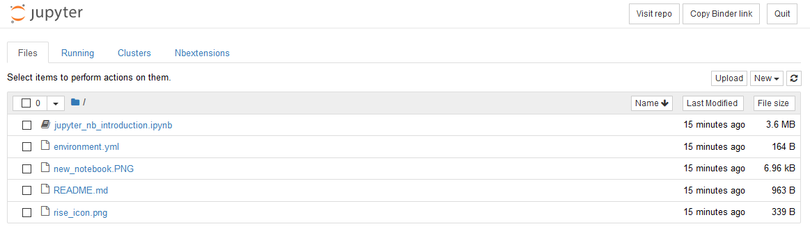
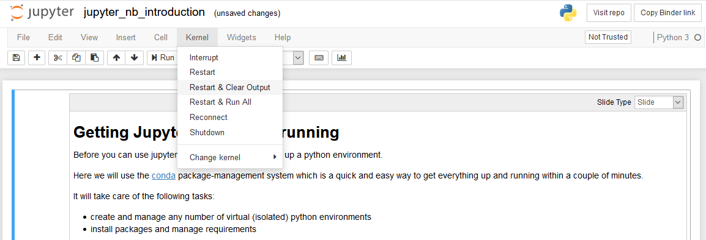
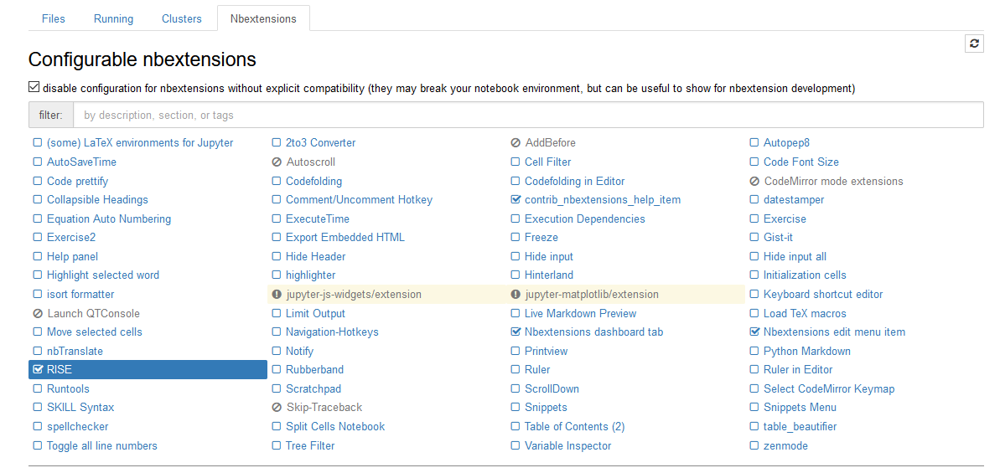
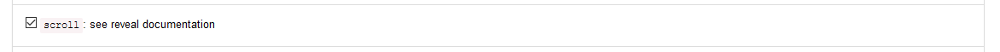

# jupyter_notebook_intro
A short introduction to jupyter notebooks

To have a look at the notebook, and get introductions how to set it up locally, 
just click at the **[jupyter_nb_introduction.ipynb](jupyter_nb_introduction.ipynb)** file 
(GitHub should render it automatically)

## Using Binder to run the notebook without a local installation
To try jupyter notebooks **without installing anything locally**, click on the "launch binder" icon above
and wait for the server to complete setting up the environment. 
(this **might take several minutes** since the python environment etc. has to be set up on a server with **limited resources**)

Once it's completed you should arrive at a page looking something like this  
(completely similar to what you would get by using a local installation):

- click on the **jupyter_nb_introduction.ipynpl** file and select **kernel** -> **Restart & Run All** to execute the notebook

- click on the Rise-icon on the right  to start the notebook as an interactive HTML-presentation 

### Enable scrolling the presentation slides
some slides might be to large for your screen. (particularly those that contain code-cells)

in order to enable scrolling the slides go to the **nbextensions** tab and click on **Rise**

Then navigate down to the following line and activate *scroll*

Now, re-open the notebook to have a scrollable presentation!
